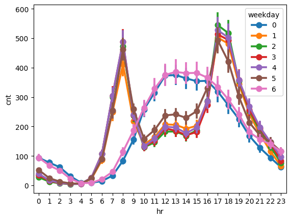

# Prédiction des locations de vélos


Analyse de **17 379 relevés horaires** pour estimer le nombre de vélos loués (`cnt`) à partir du calendrier et des conditions météo. Le [notebook complet](notebooks/bike_rental_analysis.ipynb) rassemble la préparation des données, les graphiques, les modèles et leurs résultats ; il est lisible directement sur GitHub.

- **Data engineering** : ingestion du [CSV](data/velo.csv), contrôle des données manquantes, imputation, encodage des catégories et création d'indicateurs de jours ouvrés et d'heures de pointe.
- **Exploration** : visualisations de la demande selon l'heure, la saison et la météo, puis segmentation K-Means et ACP sur les variables météo.
- **Modélisation** : régression linéaire comme référence, XGBoost, régularisation L2 et optimisation des hyperparamètres avec FLAML.



Les jours ouvrés présentent deux pics de demande, vers 8 h et 17–18 h ; le profil du week-end est différent.

| Modèle | R² sur `log(cnt)` | RMSE en vélos |
| --- | ---: | ---: |
| Régression linéaire | 0,8056 | 103,75 |
| XGBoost | 0,9086 | 71,08 |
| XGBoost + régularisation L2 | 0,9112 | 70,67 |
| XGBoost optimisé avec FLAML | 0,9250 | 67,91 |

Ces scores proviennent de l'exécution du notebook sur un test aléatoire de 20 %. La recherche FLAML est limitée à 120 secondes et peut varier d'une exécution à l'autre. Pour prévoir des heures futures, une validation chronologique et une imputation ajustée seulement sur l'entraînement donneraient une évaluation plus fiable.

Pour reproduire l'analyse avec Python 3.12, depuis la racine du dépôt :

```bash
python -m pip install -r requirements.txt
jupyter lab notebooks/bike_rental_analysis.ipynb
```
