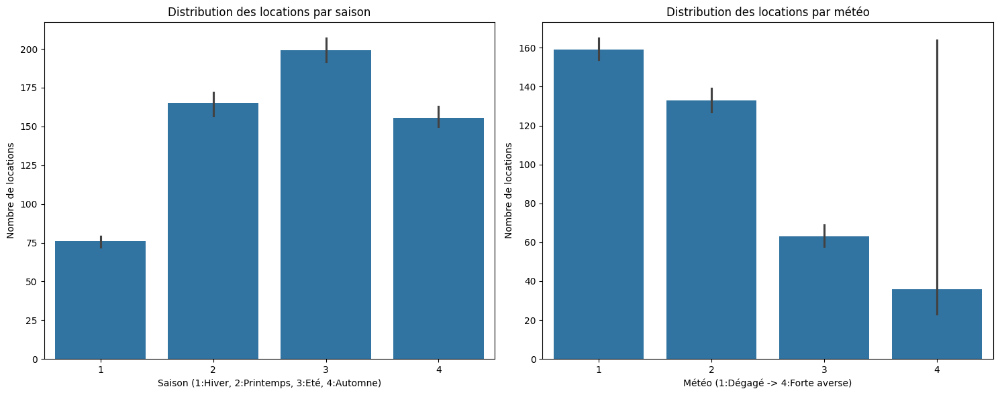
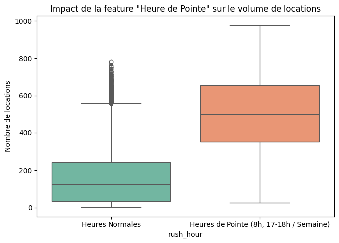
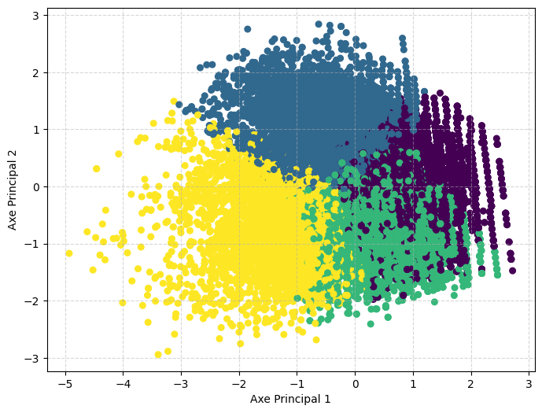

# Analyse de la demande de vélos

Le [jeu de données](../data/velo.csv) contient **17 379 observations horaires**. La cible `cnt` mesure le nombre total de locations ; `casual` et `registered`, dont la somme forme `cnt`, sont écartées des variables prédictives pour éviter une fuite directe de la réponse.

## Préparation des données

La lecture du CSV révèle **1 664 valeurs manquantes** dans `hum`. L'analyse les remplace par la médiane, traite les variables de calendrier et de météo comme des catégories, puis construit `workingday` et `rush_hour` pour distinguer les jours ouvrés et les heures de pointe.

## Ce qui influence la demande

Les horaires structurent fortement les locations : les jours ouvrés ont des pics vers 8 h et 17–18 h, tandis que le week-end concentre davantage de trajets au milieu de la journée.

La saison et les conditions météo modifient également le niveau de demande. Le graphique montre des valeurs médianes plus élevées pour la saison 3 et les meilleures conditions météo du jeu de données.

L'indicateur `rush_hour` résume le contraste entre les heures de pointe ouvrées et les autres heures : **498 locations en moyenne**, contre **160** hors pointe.

Une segmentation K-Means des variables `temp`, `hum` et `windspeed`, projetée sur deux axes par ACP, aide à lire différents profils de conditions météo sans utiliser la cible.

## Modèles et limites

La régression linéaire sert de référence (RMSE **103,75** vélos). XGBoost réduit cette erreur à **71,08**, puis la régularisation L2 à **70,67**. Une recherche d'hyperparamètres avec FLAML atteint **67,91** sur l'exécution conservée dans le [notebook](../notebooks/bike_rental_analysis.ipynb).

Le test est issu d'une séparation aléatoire des observations. Une validation chronologique, avec les prétraitements ajustés uniquement sur l'entraînement, serait plus adaptée à la prédiction d'heures futures.
